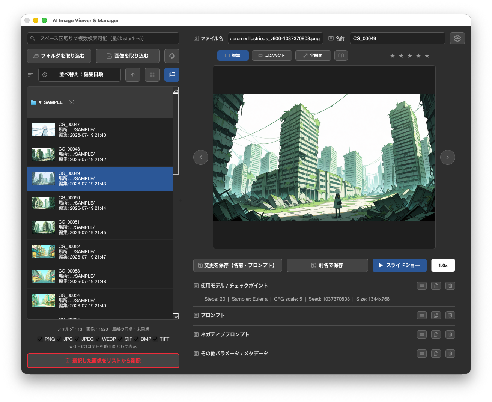

2026/08/20 (v1.4.0)

[日本語版はこちら / Japanese README is here](./README.ja.md)


## Seed Book (AI image browser)
A desktop app for centrally managing and viewing images generated by AI tools such as Stable Diffusion, along with their metadata (prompts, negative prompts, model parameters, etc.). Optimized for Stability Matrix output, but works well alongside other file management tools too.

> **Why I Built This** <br>
> Stability Matrix dumps generated images into a single "inference" folder, and the default preview layout was hard to browse. That frustration led me to build a tool for comfortably previewing large batches of images without ever modifying the originals. It also works well as a general-purpose image viewer.
>
> **About the Development Process** <br>
> I don't have a professional programming background — this app is built through "vibe coding," designing and implementing features via ongoing dialogue with AI (Anthropic's Claude / Sonnet as my coding partner). Every feature is manually tested, builds are verified in a clean user account, and releases go through proper Apple notarization before distribution.

For more detailed usage instructions, see [manual.md](./manual.md) (a [Japanese manual](./manual.ja.md) is also available).<br>
The app can switch its display language (Auto / Japanese / English) from Settings.

📖 Development progress and notes are also shared on the [dev diary](https://ocoe-puipui.github.io/diary/) (Japanese only).

---

## Table of Contents
1. [Technical Stack](#technical-stack)
2. [How to Run the Application](#how-to-run-the-application)
3. [File Structure & Roles](#file-structure--roles)
4. [Features](#features)
5. [Known Limitations](#known-limitations)
6. [Disclaimer](#disclaimer)
7. [License](#license)

---

## Technical Stack

**Language** Python 3.10+

**GUI Framework** PySide6 (Qt for Python)

**Image Processing** Pillow (PIL)

**Database** SQLite3

**OS Compatibility** Cross-platform compatible

**AI Coding Partner** Anthropic's Claude (Sonnet)

---

## How to Run the Application

### 1. Install Dependencies
```bash
pip install -r requirements.txt
```

### 2. Launch the App
```bash
python main.py
```

---

## File Structure & Roles
This project consists of five core files, cleanly modularized by role:

#### 1. `main.py` (Entry Point)
The main execution entry point. Initializes and displays the GUI application window.

#### 2. `app.py` (Core Logic)
Handles the entire UI, filtering, sorting, grouping, slideshow, clipboard integration, theme switching, and the settings dialog.

#### 3. `importer.py` (Data Extraction)
Extracts metadata via Pillow, computes SHA-256 hashes, and handles import synchronization.

#### 4. `database.py` (Database)
Manages the SQLite3 database, with auto-migrations to keep data integrity.

#### 5. `.gitignore` (Exclusions)
Excludes `venv`, `__pycache__`, `image_metadata*.db`, and `current_db.txt` (which tracks the active database).

---

## Features

#### 1. Sync & Import

**Differential Auto-Import** <br>
Remembers imported folder paths and scans only new images on "Sync." Both import and sync only scan files directly inside the folder (subfolders excluded).

**Import Order Confirmation** <br>
Choose the import order (by name, creation date, or modification date, ascending/descending). Settings let you confirm every time (default) or auto-reuse the last order.

**Individual File Import** <br>
Select and import individual image files (multi-select) instead of a whole folder.

**Automatic Sequential Naming** <br>
Newly imported images default to a sequence-numbered name (e.g., CG_00001) instead of the original filename. Prefix, digit count, and an optional append string are configurable in Settings; each combination keeps its own counter (never reused after deletion, though it can be reset manually). Sequential naming can be toggled off to use the real filename instead. Prefix/append support `{date}` and `{folder name}` placeholders.

**Per-Folder Naming Override** <br>
Right-click a folder header in "Group by Folder" view to set a folder-specific naming rule that overrides the app-wide default, applying to new imports as well as Bulk Rename / Bulk Export in that folder.

**Selectable Import Formats** <br>
PNG / JPG / JPEG / WEBP are enabled by default; GIF / BMP / TIFF can be enabled via checkboxes.

**Duplicate Prevention** <br>
Compares file content via **SHA-256 hash**, skipping duplicates automatically (opt-in to import duplicates anyway from the confirmation dialog).

**Background Processing** <br>
Displays a real-time progress dialog during large imports, cancelable partway through.

#### 2. Viewer

**Automatic Parameter Separation** <br>
Parses metadata into Prompt, Negative Prompt, and Other Details (Steps, Sampler, Seed, etc.). Steps/Sampler/Scheduler/CFG scale/Seed/Size can also display as individual fields (toggleable). Seed has a dedicated copy button.

**Supported Formats** <br>
Stable Diffusion WebUI (Automatic1111 / Forge), NovelAI, and ComfyUI. Since ComfyUI workflows vary widely, prompts aren't auto-extracted — the full workflow is preserved as-is in the metadata field.

**Camera EXIF Display** <br>
For photos without AI-generation metadata (JPEG/TIFF/WEBP), the app reads camera EXIF (make, model, date, exposure, F-number, ISO, focal length, GPS) into the metadata field.

**Per-Image Memo Field** <br>
A free-text memo field, independent of AI metadata, included in search.

**One-Click Copy** Copies any prompt field's content to the clipboard.

**Star Rating** <br>
Hover for a live preview, click for a 0–5 rating; click again to clear.

**Preview Display Modes** <br>
Hidden, Standard, Compact, and Fullscreen. Navigation, slideshow, and speed controls remain functional even in fullscreen.

**Drag Out the Preview Image** <br>
Drag the previewed image directly to Finder/Explorer or another app.

**Rename Actual Files** <br>
Directly rename the file on disk, independent of the in-app "Name" (no duplicates within the same folder).

**Freely Editable Name** <br>
The in-app "Name" field is independent of the real filename and can be reused across images.

**Save as New Copy** <br>
Save edits as a new copy without modifying the original.

**Bulk Rename (In-App "Name" Only)** <br>
Renumber the in-app "Name" for multiple selected images using your naming rule. **Actual filenames on disk are never touched.**

**Bulk Export with Rename (Actual Filenames)** <br>
Copy originals unchanged into a chosen folder, with the copies' filenames sequentially renamed — kept distinct from Bulk Rename above.

**Clear Metadata Fields** <br>
One-click clear for model/prompt/negative prompt/memo/other fields (pending until "Save").

**Toggle Metadata Fields** <br>
Hide individual fields; freed space distributes evenly among the rest. A single button can show/hide all fields at once.

**List Placeholder Messages** <br>
Friendly messages when the list is empty or files are dragged over it (drag-and-drop import is currently disabled — see below).

**Icon Design** <br>
Icons based on Google Material Symbols, with colors that adjust automatically for theme and button background.

#### 3. UX & OS Integration

**Safe Drag & Drop** Drag images from the app's list to OS folders or other apps — only a copy is made.

**Right-Click Menu** <br>
Reveal in Finder/Explorer, copy the file, or copy its path (multi-selection supported).

**Dark/Light Theme** <br>
Follows the macOS appearance setting automatically, or can be fixed manually from Settings.

**Panel Layout Switching** <br>
Choose whether search/import/list appear on the left or right (Standard / Mirrored).

**Edit Lock** <br>
Lock/unlock editing per image from the right-click menu; locked images can't be deleted or modified.

**Sync-Safe Deletion** <br>
Deleted images stay removed even after "Sync," until explicitly re-imported.

**Settings Dialog (⚙)** <br>
Sequential naming rule configuration, individual parameter display toggles, theme/panel-layout switching, import order preferences, database reset, CSV export, multi-database management, and a full settings reset. Help and release notes open from the top of the main window.

**Multiple Database Switching** <br>
Create and switch between multiple databases (`image_metadata.db`, `image_metadata2.db`, ...) from Settings (switching restarts the app). Stored in `~/Library/Application Support/AIImageViewer/`.

#### 4. Search, Sort & Slideshow

**Real-time Filtering** <br>
Filters the list by keyword (name, real filename, prompt, negative prompt, other metadata) or star rating.

**Sorting** <br>
Sort by name, creation date, last-edited date, import date, rating, or file size, with independent ascending/descending toggle. Instantly switch between grid and list views.

**Adjustable Thumbnail Size** <br>
Three tile sizes (Small/Medium/Large) in grid view; Large also shows location and date.

**Group by Folder** <br>
Group images under folder headers in list view; click to collapse/expand, right-click to reorder via drag-and-drop. State is remembered across restarts.

**Slideshow Playback** <br>
Automatic playback via timer, 0.5x–2x speed in 0.25 increments, optionally limited to the current search filter.

**Reading Mode (Two-Page Spread View)** <br>
Displays same-folder images side-by-side like an open book (available with "Group by Folder" or while viewing an album). Supports left/right reading direction, page turning via slider/arrow keys/edge clicks, dark/light background toggle, and a center-aligned display. View-only.

#### 5. Albums (Virtual Folders) (v1.4+)

**A virtual container that groups images across real folders** <br>
Create "Albums" to freely group images independent of the real folder structure. An image can belong to multiple albums. Image list view and album view are mutually exclusive, switched via the toggle buttons at the top.

**Adding images to an album** <br>
Via the right-click menu ("Add to Album" — existing or new) and via drag-and-drop onto an album row.

**Set an auto-numbering rule right when you create the album** <br>
The "Create an Album" dialog lets you set an album-specific numbering rule (prefix, digits, append) alongside the name (off by default). Supports {album name} and {date} placeholders.

**Album list behaves like folder-grouped view** <br>
Click to expand/collapse; right-click (or the "⋯" icon) for reordering, renaming, expand/collapse all, bulk export with renaming, numbering settings, and deletion.

**Album-specific auto-numbering rule** <br>
Takes priority for bulk-rename and sequential export within that album (independent from folder rules or the app-wide default). Works with a single selected image too.

**Exporting to Finder** <br>
Drag an album or its images onto Finder to export; since albums have no real folder, they're materialized to a temp folder at drag time, preserving original filenames without applying the numbering rule (use "Export Album Images as Renamed Copies" for that).

**Works with search and sorting** <br>
Search and sort apply within the currently open album too.

---

## Known Limitations

**Drag & Drop Import Temporarily Disabled** <br>
Dragging files directly from Finder onto the image list is disabled due to unstable behavior. Use the "Import Folder" / "Import Images" buttons instead.

---
## Disclaimer

**Purpose** <br>
This project was developed solely for personal study, research, and image management workflow enhancement.

**Intellectual Property (IP)** <br>
The author assumes no responsibility for any conflicts regarding third-party tool terms of service, AI licenses, or intellectual property rights arising from the use of this program. Please use it within the scope of relevant laws and regulations.

**No Warranty** <br>
This program is provided "as is" without warranty of any kind, express or implied. In no event shall the author be liable for any claim, damages, or other liability arising from the use of this software.

---
## License

This project's own code is proprietary (All Rights Reserved) for now; see [LICENSE](./LICENSE) for the full terms (a free, freeware-style license — not open source yet, but planned for the future). It uses third-party open-source libraries under their own licenses; see [THIRD-PARTY-NOTICES.md](./THIRD-PARTY-NOTICES.md) for details (PySide6/Qt under LGPLv3, Pillow under MIT-CMU).

---
<p>

</p>
<br>
THANKS!
