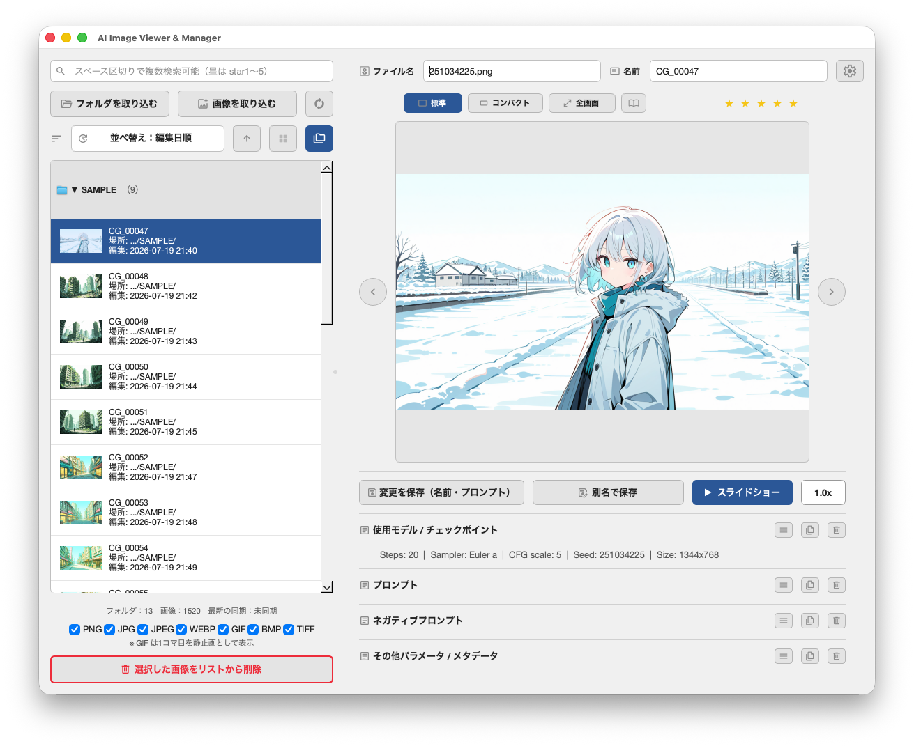
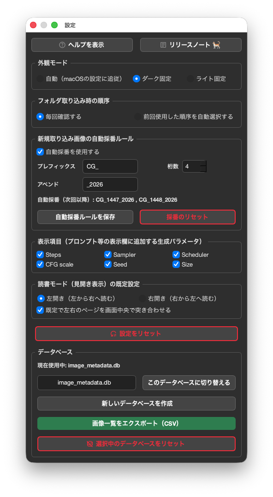

# Seed Book (AI image browser) - ユーザーマニュアル

**Language:** 日本語 | [English](./manual.md)

## 目次
1. [アプリのUI名称と役割](#1-アプリのui名称と役割)
2. [基本的な使い方](#2-基本的な使い方)
3. [アルバム（仮想フォルダ）機能](#3-アルバム仮想フォルダ機能)
4. [設定画面](#4-設定画面)
5. [フォルダ画像の同期ルール](#5-フォルダ画像の同期ルール)
6. [データのバックアップ・移行](#6-データのバックアップ移行)
7. [既知の制限事項](#7-既知の制限事項)

---

## 1. アプリのUI名称と役割




本アプリは、左側の「リスト表示エリア」と右側の「編集エリア」の2ペイン、および「設定」で構成されています。

### 1.1 リスト表示エリア（左側）
* **検索・設定行:**
  * **検索欄:** 任意のキーワードで画像を絞り込みます。
  * **設定ボタン（歯車）:** アプリの各種設定ダイアログを開きます。
* **取り込み・同期行:**
  * **フォルダを取り込む:** 指定したフォルダ内の画像をまとめて取り込みます。
  * **画像を取り込む:** 指定した画像ファイルを取り込みます。
  * **同期ボタン（🔄アイコン）:** フォルダの最新状態と同期します。
* **フォルダ/アルバム切替行:**
  * **フォルダ／アルバム切替ボタン:** 通常の画像リスト表示と、後述のアルバム表示を切り替えます（[3. アルバム（仮想フォルダ）機能](#3-アルバム仮想フォルダ機能)参照）。アルバム表示中は「アルバムを作成する」ボタンも表示されます。
* **並べ替え・表示切替行:**
  * **並べ替え / 昇順・降順切替:** 画像リストの表示順を変更します。「ファイル名順」（実際のファイル名基準）と「名前順」（アプリ内で管理する「名前」欄基準）は別の選択肢として区別されています。
  * **リスト/グリッド表示切替ボタン:** リスト表示とグリッド（サムネイル）表示を切り替えます。
  * **フォルダ別グループ表示切替ボタン:** フォルダごとに画像をグループ化して表示します。
* **グリッドサイズ選択行**（グリッド表示中のみ）:
  * サムネイルのサイズを「小」「中」「大」から選択します。
* **リスト下部:**
  * **ライブラリ情報:** 取り込み済みのフォルダ数・画像数と、最後に同期した日時が表示されます（一度も同期していない場合は「未同期」と表示されます）。
  * **削除ボタン:** 選択した画像をリストから削除します。

### 1.2 編集エリア（右側）
* **ファイル名・名前行:** 画像のファイル名や表示名を編集します。
* **プレビューエリア:** 
  * プレビューサイズの変更（非表示 / 標準 / コンパクト / 全画面）。「非表示」を選ぶと画像プレビューが隠れ、その分メタデータ編集エリアを広く使えます。
  * 星評価（★）の付与。
  * 前の画像 / 次の画像へのナビゲーション。
* **保存・スライドショー行:**
  * **変更を保存:** 編集した内容を保存します。
  * **別名で保存:** 別ファイルとして保存します。
  * **スライドショー開始/停止:** 画像を自動で切り替えるスライドショーを実行します。再生速度の調整も可能です。
* **メモ欄:** 編集エリア最上部にある、画像ごとの自由記入メモ欄です。プロンプト等のメタデータには一切影響しない、アプリ内だけで使う情報です。書いた内容は検索対象にもなります。
* **メタデータ編集欄:**
  * メモ欄の下に、「使用モデル / チェックポイント」「プロンプト」「ネガティブプロンプト」「その他パラメータ / メタデータ / EXIF情報」の順でAI画像特有の情報を確認・編集できます。
  * メモ欄を含め、各項目の見出し行にある「表示/非表示ボタン」「コピー」「この欄をクリア」を使用できます。

---

## 2. 基本的な使い方

### 2.1 画像の取り込み

**対応形式:** PNG / JPG / JPEG / WEBP（既定でオン）、GIF / BMP / TIFF（選択可・既定はオフ。取り込み画面下部のチェックボックスで有効化できます）。このチェックボックス欄の左端にある表示/非表示ボタンで、欄全体を一時的に畳んでリスト表示エリアを広く使うこともできます。

* **フォルダを取り込む:** フォルダを選択すると、直下にある画像がまとめて取り込まれます（サブフォルダの中身は対象外です）。取り込み時には、ファイル名順・ファイル名逆順・作成日時順・更新日時順（それぞれ昇順/降順）から取り込み順序を選べます。同じ画面の下部にある「中身が同じ画像も取り込む」チェックボックス（既定はオフ）で、内容が完全に一致する画像（ファイル名が違っていても中身が同じもの）を、あえて別レコードとして取り込むかどうかも選べます。この確認画面自体は、設定画面から「毎回確認する」「前回と同じ設定を自動で使う」のいずれかに切り替えられます。
* **画像を取り込む:** ファイル選択ダイアログから、画像を個別に複数選択して取り込みます。フォルダ全体ではなく一部の画像だけを取り込みたい場合に便利です。
* **同期（🔄）:** これまでに取り込んだフォルダを再スキャンし、新しく追加された画像を取り込みます。同期の詳しいルールは「[5. フォルダ画像の同期ルール](#5-フォルダ画像の同期ルール)」をご覧ください。

**中身が同じ画像を取り込んだ場合について:** 「中身が同じ画像も取り込む」をオンにして取り込んだ画像は、それぞれ独立した別の画像として登録されます。見た目（サムネイル・プレビュー）は同じになりますが、評価・名前・プロンプトの編集は個別に管理され、片方を変更してももう片方には反映されません。

### 2.2 対応しているメタデータの種類

画像に埋め込まれた生成AIの情報（プロンプト等）は、ツールの種類によって自動で判別されます。

| ツール | 対応状況 |
|---|---|
| Stable Diffusion WebUI（Automatic1111 / Forge） | プロンプト・ネガティブプロンプト・その他パラメータを自動で分離して表示 |
| NovelAI | 同上 |
| ComfyUI | ワークフローの構成が多岐にわたるため、プロンプトの自動抽出は行いません。ワークフロー全体（LoRA・バッチサイズ等の設定を含む）を「その他パラメータ / メタデータ / EXIF情報」欄にそのまま保存します |

さらに、Steps・Sampler・Scheduler・CFG scale・Seed・Sizeの6項目は、「使用モデル」欄の下に個別項目として表示できます（表示するかどうかは設定画面で項目ごとに切り替え可能。既定は非表示です）。

**カメラ写真のEXIF情報について:** 上記のAI生成パラメータが見つからなかった場合、JPEG/TIFF/WEBPなど元々EXIFを持つ形式であれば、メーカー・機種・撮影日時・露出時間・F値・ISO感度・焦点距離・GPS座標などのカメラ由来のEXIF情報を自動で読み取り、「その他パラメータ / メタデータ / EXIF情報」欄に整形して表示します（プロンプト欄にはその旨の案内文が入ります）。PNG・GIF・BMPはこの方式でのEXIF読み取りには対応していません。

### 2.3 画像の閲覧・整理

* **プレビュー:** 画像を選択すると右側に表示されます。「非表示」「標準」「コンパクト」「全画面」の4種類の表示モードを切り替えられます。「非表示」はプレビュー画像を隠してメタデータ編集エリアを広げたい時に使います。全画面表示中も、画像送り・スライドショー・再生速度の操作はそのまま行えます。プレビュー画像はFinder等の外部アプリへドラッグ＆ドロップして取り出す（コピーする）こともできます。プレビューエリアを一度クリックしてフォーカスを与えると、以後は左右キーでも前後の画像に送れます（検索欄など他の入力欄から誤ってフォーカスが移らないよう、クリックした場合のみ有効になります）。
* **星評価:** ★にマウスを乗せるとプレビュー表示され、クリックで0〜5段階の評価を設定できます。同じ星をもう一度クリックすると評価を解除できます。
* **検索:** 検索欄にキーワードを入力すると、画像を対象に絞り込みます。次の項目をまとめて（横断的に）検索できます。
  * 「名前」欄・実際のファイル名（拡張子含む）・フォルダ名・場所（パス）・評価・作成/編集/取り込みの各日時・ファイルサイズ・プロンプト・ネガティブプロンプト・その他メタデータ・メモ欄
  * **AND 検索:** スペース区切りで複数キーワードを入れると、すべてを含む画像に絞り込まれます（例: `猫 夕焼け`）。
  * **OR 検索:** キーワードの間に `OR` を入れると、どちらか一方を含む画像が対象になります（例: `猫 OR 犬`）。
  * **除外検索:** キーワードの先頭に `-` を付けると、その語を含む画像を除外します（例: `猫 -屋外`）。
  * **フレーズ検索:** `"..."` で囲むと、スペースを含む語をひとまとまりとして扱います（例: `"名称未設定フォルダ 2"`）。
  * **評価で絞り込み:** `star1`〜`star5`、または `★★★` のような星マーク、`3` のような数値でも該当評価の画像に絞り込めます。
  * **期間で絞り込み:** 日時の種類を接頭辞で指定します（`c:` 作成 / `m:` 編集 / `i:` 取り込み）。範囲は `..` で区切り、片側だけの指定や、年・年月・年月日の粒度が使えます。
    * `c:2026-07` … 2026年7月に作成された画像
    * `c:2026-07-01..2026-07-31` … 作成日が期間内
    * `i:2026-07-30..` … 2026年7月30日以降に取り込み
    * `m:..2026-07` … 2026年7月以前に編集
    * 他のキーワードと組み合わせると AND 条件になります（例: `猫 c:2026-07`）。
  * 大文字/小文字・全角/半角の違いは自動的に同一視されるため、どちらで入力しても同じ結果になります。
  * なお「フォルダ別グループ表示」で**折りたたみ中**のフォルダの画像は、検索対象外です（見出し行に「（折りたたみ中は検索対象外）」と表示されます）。検索したい場合は見出しをクリックして展開してください。
  * 検索して一致する画像が1件もない場合の案内は、表示方法によって異なります。いずれの場合もフォルダの見出し（フォルダアイコン）は消えずに残ります。
    * **通常のリスト表示:** リストの中央に「検索結果は 0 件です」と表示されます。
    * **フォルダ別グループ表示:** 開いている（展開中の）フォルダの見出しの下に「検索結果は 0 件です」と表示されます。
    * **すべてのフォルダを折りたたんでいる場合:** どのフォルダも検索対象外のため、「検索したいフォルダを開いてください」という案内がポップアップで一度だけ表示されます（フォルダを開くか検索を消すと、次回また案内されます）。
* **並べ替え:** 名前順・作成日順・編集日順・取り込み日時順・評価順・ファイルサイズ順から選べ、昇順/降順は別のボタンで独立して切り替えられます。最後に使った並べ替え条件は、アプリを再起動しても記憶されています。リスト表示では、ファイル名の下に、選んでいる並べ替えの種類に応じた補足情報（作成日時・編集日時・取り込み日時・ファイルサイズ）が表示されます（名前順・評価順のときは作成日時を表示します）。
* **リスト/グリッド表示:** リスト表示とサムネイルのグリッド表示を切り替えられます。グリッド表示では、サムネイルサイズを「小」「中」「大」から選べます（「大」を選ぶと、サムネイルの下に場所・作成日時も表示されます）。
* **フォルダ別グループ表示:** リスト表示中、画像をフォルダ別に見出しでグループ化できます（有効な間は、グリッド表示への切り替えはできません）。見出し行には、フォルダ名とそのフォルダ内の画像枚数（数字のみ）が表示されます。見出し行をクリックすると、そのフォルダの画像一覧を折りたたみ/展開できます（▼が展開中、▶が折りたたみ中を示します）。見出し行を**右クリック**すると「フォルダの並び順を編集」メニューが表示され、ドラッグ&ドロップでフォルダの並び順を変更できます。見出し行を**Finder等の外部アプリへドラッグ&ドロップ**すると、そのフォルダ（実フォルダ）ごとコピーできます（プレビュー画像のドラッグアウトと同様、常に「コピー」のみで、元のフォルダは移動・削除されません）。右クリックメニューの「フォルダ内の画像を一括で書き出す（連番でリネーム）...」を選ぶと、書き出し先フォルダを指定した上で、そのフォルダ内のDB登録済み画像を自動採番ルールで連番リネームしながらコピーできます（未登録の紛れ込みファイルは対象外です）。「フォルダ専用の自動採番を設定...」を選ぶと、そのフォルダのプレフィックス・桁数・アペンドをアプリ全体の既定から上書きできます（チェックボックスをオフにすると既定に戻ります）。この上書きは、新規に取り込む画像だけでなく、そのフォルダの画像を「選択画像を一括リネーム」「一括で書き出す」する際にも優先して使われます。「フォルダをデータベースから削除...」を選ぶと、そのフォルダと中の画像をまとめてデータベースから削除できます（ディスク上の実ファイルは削除されません）。削除後はそのフォルダが画像リストに表示されなくなり、以後の同期（自動再スキャン）の対象からも外れます。改めて「フォルダを取り込む」で取り込み直せば、再び同期対象に戻ります。グループ表示のON/OFF・折りたたみ状態・フォルダの並び順は、いずれも次回起動時まで記憶されます。

### 2.4 メタデータの確認・編集

* 右側の「メモ」「使用モデル / チェックポイント」「プロンプト」「ネガティブプロンプト」「その他パラメータ / メタデータ / EXIF情報」の各欄で、生成時の情報（またはカメラ写真の場合はEXIF情報）やメモを確認・編集できます。
* 各欄の見出し行にある3つのボタンで、それぞれ「表示/非表示の切り替え」「コピー」「この欄をクリア」ができます。クリアやプロンプトの編集内容は、「変更を保存」を押すまでは確定しません（誤操作しても安心です）。
* 画面右上の一括表示/非表示ボタンを押すと、これら5つの編集欄・取り込み対象形式のチェックボックス欄を、まとめて表示・非表示に切り替えられます。
* 「ファイル名」はパソコン上の実際のファイル名、「名前」はアプリ内だけで使う表示名です。「名前」は実際のファイル名とは別に自由に変更・重複でき、検索用のタグのような使い方もできます。新規に取り込んだ画像の「名前」には、既定で自動採番（例: CG_00001）が付けられます。

### 2.5 編集の保存・複製・削除

* **変更を保存:** 名前・評価・プロンプト等の編集内容を保存します。複数の画像を選択している場合は、評価のみを一括で保存できます。
* **別名で保存:** オリジナルのファイルは変更せず、編集した内容を持つ新しいコピーとして、指定した場所に保存します。
* **編集ロック:** 画像を右クリックすると「編集をロック」できます。ロック中は、削除や情報変更（名前・評価・プロンプト等）ができなくなり、誤操作から画像を守れます。
* **一括リネーム:** 画像を複数選択して右クリックすると「選択画像を一括リネーム（連番）...」が表示されます。設定画面の自動採番ルール（プレフィックス・桁数・アペンド）をそのまま使って、DB上の**「名前」欄のみ**を連番に揃えます。**パソコン上の実ファイル名は変更されません**（実ファイル名も揃えたい場合は「一括で書き出す」をご利用ください）。フォルダ専用の自動採番が設定されているフォルダの画像は、そちらのルールが優先して使われます。番号はこの操作専用の一時的なカウンタで1から振られ、取り込み時の自動採番カウンタには影響しません。プレフィックス・アペンドに`{フォルダ名}`が含まれる場合は、フォルダごとに別々に1から採番されます。編集ロック中の画像は対象外です。実行前に、変更後の名前の例を含む確認ポップアップが表示されます。
* **一括で書き出す（連番でリネーム）:** 画像を右クリック（複数選択可）すると「選択画像を一括で書き出す（連番でリネーム）...」が表示されます。書き出し先フォルダを選ぶと、元ファイルはそのままに、自動採番ルールに沿って**実ファイル名**を連番リネームしたコピーを作成します（拡張子含む）。一括リネームと同じ一時カウンタ・{フォルダ名}対応を使うため、動作イメージは共通です。「コピー」ではなく「書き出す」という表記にしているのは、ファイル名をそのままコピーするFinderへのドラッグ&ドロップ（元の名前のまま複製）と区別するためです。
* 「リネーム時に編集画面を表示する」がオンの場合の確認・編集画面は、一括リネームでは「現在の名前」／「変更後の名前」、一括で書き出すでは「現在のファイル名」／「変更後のファイル名」という表記になり、それぞれの対象（DB上の名前／実ファイル名）が分かりやすいようにしています。
* **削除:** 「選択した画像をリストから削除」を押すと、アプリのリストから画像を除外します。パソコン上の実際の画像ファイルは削除されません。削除した画像は、以後「同期」を実行しても自動では復活しません（詳しくは「[5. フォルダ画像の同期ルール](#5-フォルダ画像の同期ルール)」をご覧ください）。

### 2.6 スライドショー

「スライドショー」ボタンで自動再生を開始できます。再生速度は0.5倍〜2倍の範囲で0.25刻みに調整できます。検索で絞り込んだ状態でスライドショーを開始すると、絞り込んだ画像だけを自動巡回します。

### 2.7 読書モード（見開き表示）

選択した画像と同じフォルダ内の画像を、本を開いたように2枚並べて全画面表示するモードです。プレビューエリアの「全画面」ボタンの右隣にある専用ボタンから起動します。

* **利用条件:** 「フォルダ別グループ表示」が有効な時、または後述のアルバム表示中にアルバム内の画像を選択している時に利用できます（それ以外はボタンがグレーアウトします）。
* **並び順:** アプリの現在の並べ替え設定に関わらず、常に「名前順」で表示されます。
* **開き方向:** 「左開き（左から右へ読む）」「右開き（右から左へ読む）」を切り替えられます。見開き表示中の切り替えボタンでの変更はその場限りで、既定値は設定画面から変更します。
* **ページ操作:** 画面下部のスライドバー（見開き単位で移動）、最初/最後の見開きへのジャンプボタン、左右の矢印キー、画面の左右端（幅の約15%）のクリックに対応しています。矢印キー・端クリックは、画面上の左右ではなく、その時点の「読む方向」に従って進む/戻るが決まります（右開き時は→キーで戻り、←キーで進みます）。
* **背景の切り替え:** スライドバー左端のボタンで、読書モードの背景をダーク/ライトに切り替えられます。アプリ本体のテーマ設定とは独立しており、次回もこのモードを開いた時に記憶されます。
* **中央詰め表示:** 背景切り替えボタンの右隣のボタンで、左右のページの並べ方を切り替えられます。通常は各ページを表示エリア内で中央に配置しますが、オンにすると、実際の本や電子書籍のように、左右のページを画面中央でぴったり突き合わせて表示します。切り替えるたびに設定として保存され、次回もこのモードを開いた時に記憶されます。
* **現在の開き方向表示:** 画面右上に、現在の開き方向（▶ 左開き / ◀ 右開き）が常時表示されます。
* このモード中は閲覧専用で、プロンプト等の編集はできません。「Esc」キーまたは終了ボタンで通常表示に戻ります。

---

## 3. アルバム（仮想フォルダ）機能

### 3.1 アルバムとは

パソコン上の実際のフォルダ構成とは別に、画像を自由にまとめられる仮想的な「アルバム」を作成できる機能です（v1.4〜）。1枚の画像を複数のアルバムに同時に所属させることもできます。通常の画像リスト表示とアルバム表示は併用せず、リスト上部の切り替えボタン（フォルダアイコン／アルバムアイコン）でどちらか一方に切り替えます。

### 3.2 アルバムの作成

「アルバムを作成する」ボタンを押すと、アルバム名の入力欄と、そのアルバム専用の自動採番ルール設定を1つにまとめたダイアログが開きます。

* アルバム名を入力してください（既定では「Seed Book {次の番号}」が自動で入りますが、自由に変更できます）。
* 「このアルバムの専用ルールとして設定する」にチェックを入れると、そのアルバムだけに使う自動採番ルール（プレフィックス・桁数・アペンド）をその場で設定できます。既定はオフで、この場合はアプリ全体の既定ルール（設定画面の「自動採番・リネーム」）が使われます。
* プレフィックス・アペンドには`{アルバム名}`・`{日付}`（今日の日付、YYYYMMDD）のプレースホルダーが使えます（英語UIでは`{album name}`/`{date}`という表記になりますが意味・動作は同じです）。
* 採番ルールは作成後も、見出し行の右クリックメニュー「アルバム専用の自動採番」からいつでも変更できます。

### 3.3 画像のアルバムへの追加

* **右クリックメニューから:** 画像リスト（またはアルバム内の画像）を右クリックし、「アルバムに追加」から既存のアルバムを選ぶか、「新しいアルバムを作成...」でその場で新規アルバムを作成しながら追加できます。このとき、追加した画像が1枚だけでも、作成ダイアログで自動採番ルールを有効にしていれば、その場で連番が適用されます。
* **ドラッグ&ドロップで:** 画像を、左側のアルバム見出し行へ直接ドラッグ&ドロップして追加することもできます。
* 複数選択した状態でも、まとめて同じ操作ができます。

### 3.4 アルバム見出し行の操作

アルバム一覧は、画像リストの「フォルダ別グループ表示」と同じ操作感です。

* 見出し行をクリックすると、そのアルバム内の画像一覧を展開/折りたたみできます（▼/▶で状態を表示）。
* 見出し行を右クリックする（または見出し右端に薄く表示される「⋯」アイコンをクリックする）と、メニューが開きます。
  * **並び順を編集:** ドラッグ&ドロップでアルバムの並び順を変更します。
  * **名前を変更:** アルバム名を変更します。
  * **すべて開く／折りたたむ:** 表示中の全アルバムをまとめて展開・折りたたみします。
  * **一括で書き出す（連番でリネーム）:** アルバム内の画像を、採番ルールに従って連番リネームしながら指定フォルダへコピー書き出しします。
  * **アルバム専用の自動採番:** そのアルバム専用の採番ルールを設定・変更・解除します（[3.2](#32-アルバムの作成)参照）。
  * **アルバムを削除:** アルバムそのものを削除します（アルバム内の画像自体は削除されません。あくまで「入れ物」を消すだけです）。

### 3.5 アルバム専用の自動採番ルールの適用範囲

アルバム専用の自動採番ルールを設定すると、次の操作で優先して使われます。

* アルバム見出しメニューの「一括で書き出す（連番でリネーム）」
* アルバム内の画像を選択しての「選択項目を一括リネーム」「選択項目を連番でコピー書き出し」（1枚のみの選択でも利用できます）

フォルダ専用の採番ルールやアプリ全体の既定ルールとは完全に独立しており、同じ操作で両方が同時に参照されることはありません。また、アルバムは画像の取り込み元にはなり得ないため、新規取り込み時の採番には影響しません。

### 3.6 Finderへの書き出しとファイル名の扱い

アルバムや、展開中のアルバム内の画像は、Finder（エクスプローラー）へ直接ドラッグ&ドロップして書き出すこともできます。アルバム自体は実フォルダを持たないため、ドラッグ開始時に一時フォルダへ画像をコピーして実体化し、Finder側には自動的に「フォルダ」として渡されます。

この方法では、**元のファイル名がそのまま使われ、採番ルールは適用されません**。採番ルールを適用したコピーが欲しい場合は、[3.4](#34-アルバム見出し行の操作)の「一括で書き出す（連番でリネーム）」をご利用ください。

### 3.7 検索・並び替えとの連携

アルバム表示中も、検索欄で開いているアルバム内の画像を絞り込み検索できます（画像リスト側と同様、該当なしの場合は「検索結果は0件です」、閉じているアルバムは「閉じているアルバムは検索対象外です」と見出し下に表示されます）。並び替えの種類・昇順/降順も、アルバム表示にそのまま反映されます。

---

## 4. 設定画面

画面右上の歯車アイコンから開きます。




* **自動採番・リネーム:** 「新規取り込み時に自動採番する」チェックボックスで、機能自体のオン/オフを切り替えられます。オフにすると、自動採番の代わりに実際のファイル名（拡張子を除く）がそのまま「名前」になります。オンの場合は、プレフィックス・桁数・末尾に付けるアペンド文字列を設定できます。プレフィックス＋アペンドの組み合わせごとに採番が独立しており、削除しても番号は再利用されません。プレフィックス・アペンドには`{フォルダ名}`（取り込み元フォルダ名）・`{日付}`（今日の日付、YYYYMMDD）のプレースホルダーが使え、フォルダや日付が変わると自動的に別の連番として管理されます（英語UIで挿入した場合は`{folder name}`/`{date}`という表記になりますが、意味・動作は同じで、どちらの表記も表示言語に関わらず使えます）。「プレースホルダー: {日付} {フォルダ名}」のリンクをクリックすると、直前にカーソルがあったプレフィックス／アペンド欄へ、区切りの「_」付きでそのまま挿入されます（手入力不要）。プレフィックス欄への挿入時は後ろに「_」が付き（例: `{フォルダ名}_`）、アペンド欄への挿入時は前に「_」が付きます（例: `_{日付}`）。「自動採番ルールを保存」を押すと、「新しいルールを保存してもいいですか？(次回以降の新規取り込みの採番から適用されます)」という確認ポップアップが表示され、「はい」を選ぶまでは確定しません。「採番のリセット」で、現在の組み合わせの番号を1に戻すこともできます（過去の画像と名前が重複する可能性があるため、実行前に確認が表示されます）。「リネーム時に編集画面を表示する」をオンにすると、一括リネーム・一括で書き出す実行前に、生成される名前を一覧（元のファイル名／変更後の名前）で確認できる編集画面が開きます。一覧の行を選ぶと、下の「名前」欄にその行の名前が読み込まれ、そこで編集した内容が一覧へ反映されます（表のセルを直接編集する方式ではありません）。同じ名前や空の名前があると該当行が赤くハイライトされ、解消するまで実行できません。オフの場合は、これまで通り確認ポップアップに例を数件示すだけで、そのまま実行されます。
* **表示項目:** Steps・Sampler・Scheduler・CFG scale・Seed・Sizeの個別表示を、項目ごとにチェックボックスでオン/オフできます。
* **外観モード:** 「自動（OSの設定に追従）」「ダーク固定」「ライト固定」を選べます。あわせて、左右パネルの配置（「標準」＝検索・リストが左／「反転」＝検索・リストが右）も同じグループ内で切り替えられます。反転時も設定ボタンはウィンドウ右上に固定表示されます。
  * これら2つは、設定画面を開かずウィンドウ右上のボタン（一括表示/非表示ボタンの右隣2つ）からもワンクリックで切り替えられます。パネル反転ボタンは押すたびに標準⇄反転をトグルし、外観モードボタンは押すたびに「自動→ダーク→ライト→自動…」と巡回します（自動＝追従中は専用アイコン、ダーク/ライト固定中はその見た目のアイコンで、現在の状態が一目で分かります）。設定画面のこの項目とは同じ設定を共有しているため、どちらから変更しても両方に反映されます。
* **表示言語:** アプリの表示言語を「自動（OSの言語設定に追従）」「日本語」「English」から選べます。選び直した内容は次回アプリを起動した時から反映されます（アプリ再起動が必要です。切り替えた場での即時反映は行いません）。「自動」を選んだ場合、OSの言語設定が日本語であれば日本語UIに、それ以外は英語UIになります。
* **フォルダ取り込み時の順序:** フォルダ取り込みのたびに順序を確認するか、前回使った順序を自動で使うかを選べます。
* **読書モードの既定設定:** 開き方向(「左開き」「右開き」)と、中央詰め表示を既定でオンにするかを選べます(読書モード自体の使い方は「[2.7 読書モード（見開き表示）](#27-読書モード見開き表示)」をご覧ください)。
* **データベース:**
  * **現在使用中のデータベースの表示・切り替え:** 一覧から選んで「データベースを変更」を押すと、アプリが自動的に再起動して切り替わります。表示の右にあるフォルダアイコンを押すと、データベースファイルの保存フォルダをFinder（Windowsはエクスプローラー）で開きます。
  * **データベースを作成:** 用途ごとに複数のデータベースを、アプリのデータ保存フォルダ内（`~/Library/Application Support/AIImageViewer/`）に作成できます（`image_metadata.db`、`image_metadata2.db`...）。確認のうえ空のデータベースが新規作成されます（作成しただけでは切り替わりません。切り替えるには改めて一覧から選んでください）。
  * **画像一覧（CSV）:** 現在使用中のデータベースに登録されている画像の一覧をCSVファイルに書き出せます。「基本情報のみ」「プロンプト等のメタ情報を含める」を選べます。
  * **同期履歴（CSV）:** 「同期」実行時に見つからなかったフォルダ・画像や、取り込みエラーの履歴をCSVファイルに書き出せます。詳しくは「[5.6 同期履歴](#56-同期履歴)」をご覧ください。
  * **データベースを初期化:** 現在使用中のデータベースから、画像・記憶したフォルダの情報をすべて削除します。パソコン上の実際の画像ファイルや、その他のアプリ設定は保持されます。
  * **データベースが見つからない場合:** アプリ起動時に、既定の保存先（`~/Library/Application Support/AIImageViewer/`）にデータベースファイルが見つからない場合（初回起動時、またはファイルを直接削除した場合）、自動で新規作成せず選択ポップアップが表示されます。「新しい空のデータベースを作成する」（既定で選択されており、初めて使う場合はこのままでOK）「同じ保存先フォルダ内の別のデータベースを選ぶ」「外部のバックアップファイルを指定して読み込む」から選べます。外部ファイルを読み込んだ場合は、有効性を確認したうえで既定の保存先に新しいデータベースとしてコピーされ、その旨が通知されます。バックアップ・移行の詳しい手順は「[6. データのバックアップ・移行](#6-データのバックアップ移行)」をご覧ください。
    「新しい空のデータベースを作成する」を選んだ場合のみ、「サンプルデータを読み込む」というチェックボックスが表示されます。チェックすると、アプリの操作方法をお試しいただけるよう、あらかじめ用意されたサンプル画像（実際のAI生成画像ではなく、取り込み・メタデータ表示の動作確認用に作成されたダミー画像）が一緒に取り込まれます。不要になれば通常の画像と同様に削除できます。
* **この設定をすべてリセット:** 命名規則・表示項目・テーマ設定などを初期値に戻します（自動採番のカウンタ自体はリセットされません）。

---

## 5. フォルダ画像の同期ルール

「フォルダを取り込む」で取り込んだフォルダは、パスを記憶しておき、「🔄 同期」ボタンで再スキャンできます。 この時の判定・挙動をまとめたものです。

なおこちらで説明している名前とはフォルダやファイルのオリジナルの名前を指します。 アプリ内の名前フォーム(自動採番のCG001、CG002の表示)ではありません。

### 5.1 再同期の対象になる条件

取り込み時に記憶した絶対パスと、完全に一致しているかどうかが唯一の条件です。

このアプリケーション以外での操作としてFinderを例にします。

* フォルダの名前を変更した → パスが変わるため、対象外になります
* フォルダを別の場所に移動した → パスが変わるため、対象外になります
* 画像ファイル自体の名前を変更・移動した場合も同様です

💡 「名前を変えた」も「移動した」も、結局は「記憶していたパスと一致しなくなった」という同じ1つの状態です。

### 5.2 対象外になった場合、画像リストではどう見えるか

登録されている画像ファイルが実際にそのパスに存在するかを確認しています（起動時や「同期」の実行時に確認し、その結果をもとにリストへ表示します）。

* 存在しなければ、その画像は画像リストに表示されません
* これは「同期」ボタンを押さなくても、フォルダを変更した直後から自動的に反映されます
* ただし、この時点ではデータベースのレコードはまだ削除されていません（一時的に「非表示」になっているだけです）
* 存在しない画像があってリストから除外された場合は、画面下部のステータスバーに「○○ 件の画像ファイルが見つからないため表示していません（外付けドライブ未接続の可能性があります）。」と一時的に案内が表示されます。外付けドライブに保存した画像が、ドライブ未接続のために消えたように見えているだけのこともあるため、この案内で気づけるようにしています。

### 5.3 データベース上の扱い（重要）

「🔄 同期」ボタンには、新しい画像を取り込むだけでなく、存在しなくなった画像のレコードをデータベースから完全に削除するという役割もあります。

| タイミング | 画像リストの表示 | データベースのレコード |
|---|---|---|
| パス変更直後（同期は未実行） | 表示されない | 残っている（一時的に非表示なだけ） |
| その後「同期」を実行した | 表示されない | 削除される（元に戻せない） |

「同期」を1度でも実行すると、その時点でパスが無効な画像は完全に削除されます。

### 5.4 元に戻す方法（復元）

#### パターンA：まだ「同期」を実行していない場合
フォルダ名・場所を元通りに戻せば、次に画像リストを開いた時点で自動的に再表示されます。再取り込みの操作は不要です。

#### パターンB：すでに「同期」を実行してしまった場合
データベースのレコードは削除されているため、フォルダを元に戻しても自動では復活しません。 「フォルダを取り込む」または「画像を取り込む」で、改めて取り込み直す必要があります。

その際、以下の情報は失われ、新規の画像として登録し直されます:
* 評価（★）
* 編集ロック状態
* 「名前」欄に付けていた独自の名称（新しい自動採番名になります）
* 保存済みのプロンプト等の編集内容

### 5.5 まとめ（一言でいうと）
* フォルダを移動・改名しても、同期ボタンさえ押さなければ、元に戻すだけで画像は復活します。
* 一度「同期」を押してしまうと、その時点で無効なパスの画像は完全に削除され、後戻りできません。
* フォルダの移動・改名を予定している間は、元に戻すまで「同期」ボタンを押さないのが安全です。

### 5.6 同期履歴
「同期」ボタンを押すたびに、見つからなかったフォルダ・画像や、取り込みエラーが自動的に記録されます。

* **ポップアップは初回のみ:** 同じ問題（同じフォルダが見つからない、同じ内容の取り込みエラー）が続いている間、ポップアップでの警告は最初の1回だけ表示されます。2回目以降は毎回ポップアップを出さず、履歴にのみ記録されます（同期のたびに同じ警告が延々と表示され続けることはありません）。
* **再発時は改めて警告:** 一度でもフォルダが見つかる状態に戻れば、警告状態はリセットされます。その後また見つからなくなった場合は、改めてポップアップで警告されます（意図的なフォルダの移動・外付けドライブの抜き差しなどを想定した挙動です）。
* **履歴の見方:** 同期結果のポップアップにある「履歴」ボタンを押すと、これまでに記録された同期履歴（日時・種別・対象パス・内容）を一覧できます。同じ内容の記録は最新の1件だけが残ります。
* **CSVへの書き出し:** 履歴ダイアログ内、または設定画面の「同期履歴（CSV）」からCSVファイルに書き出せます。
* **保持件数:** 履歴は直近500件まで保持され、それを超えた分は古いものから自動的に削除されます。

---

## 6. データのバックアップ・移行

### 6.1 データベースが見つからない場合の選択ダイアログについて
アプリ起動時に、既定の保存先にデータベースファイルが見つからない場合（初回起動時、またはファイルを直接削除した場合）、選択ポップアップが表示されます（詳細は「[4. 設定画面](#4-設定画面)」内の説明を参照）。

**通常お使いいただく分には「新しい空のデータベースを作成する」を選んでください。** これが既定で選ばれている選択肢で、初めて使う場合はこのまま「OK」を押すだけで問題ありません。「同じ保存先フォルダ内の別のデータベースを選ぶ」「外部のバックアップファイルを指定して読み込む」は、以前使っていたデータを復元したい場合にのみ使う特殊なケース向けの選択肢です。

### 6.2 データベースの保存場所
このアプリのデータ（画像の登録情報・プロンプト・評価・設定など）は、以下のフォルダに保存されています。

```
~/Library/Application Support/AIImageViewer/
```

このフォルダの中に `image_metadata.db`（既定のデータベース）や、複数作成した場合は `image_metadata2.db` などが入っています。**画像ファイル自体はここには保存されません**（取り込み元のフォルダに置いたまま管理する仕組みのため）。バックアップ・移行の対象になるのは、このフォルダの中身です。

### 6.3 バックアップの取り方
1. Finderのメニューで「移動」→「フォルダへ移動...」を選び、`~/Library/Application Support/AIImageViewer/` と入力して開きます。
2. フォルダの中身（`image_metadata.db` 等の `.db` ファイル）を、外付けディスクやクラウドストレージなど、任意の場所にコピーしておきます。

定期的に、または大きな編集作業の前後にバックアップを取っておくことをおすすめします。

### 6.4 アプリの削除・再インストール時の注意
このアプリ自体（`.app`）を削除しても、上記の `~/Library/Application Support/AIImageViewer/` フォルダは自動では削除されません。再インストール後に同じMac・同じユーザーで起動すれば、既存のデータベースがそのまま見つかり、これまで通り使い続けられます。

完全にデータごと削除したい場合は、アプリ本体に加えてこのフォルダも手動で削除してください。

### 6.5 別の環境（別のMac・別のユーザーアカウント）へ移行する場合
1. 移行元で、上記5.3の手順に従い `~/Library/Application Support/AIImageViewer/` の中身（`.db`ファイル）をコピーしておく
2. 移行先でこのアプリを一度起動する（データベースが見つからない選択ダイアログが表示されます）
3. ダイアログで「外部のバックアップファイルを指定して読み込む」を選び、コピーしておいた`.db`ファイルを指定する
4. 読み込みが完了すると、新しいデータベースとして複製され、通知が表示されます

**注意:** 画像ファイル自体（実体）はデータベースに含まれません。取り込み元のフォルダごと同じパス構成で移行先にも用意しておかないと、画像リストに「見つからないファイル」が残ってしまいます。可能であれば、画像フォルダとデータベースの両方を一緒に移行してください。

---

## 7. 既知の制限事項

**ドラッグ&ドロップでの取り込みは一時的に無効化中**

外部（Finder等）から画像リストへ直接ドラッグ&ドロップして取り込む機能は、動作が不安定だったため一時的に無効化しています。画像の取り込みは、「フォルダを取り込む」「画像を取り込む」ボタンをご利用ください。

**フォルダ別グループ表示で、折りたたみ操作後に画像送り（前へ/次へ）が反応しないことがある**

フォルダ別グループ表示中、表示中の画像を含むフォルダを折りたたんだ後、画像送り（前へ/次へボタン・キーボード操作）が正しく反応しないことがあります。致命的な不具合ではないため、原因調査・修正は今後の課題として保留しています。
